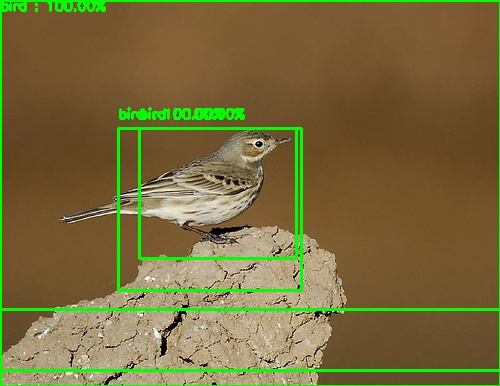
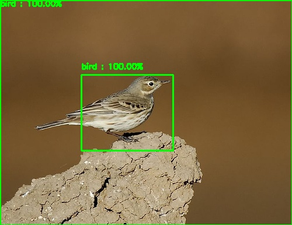
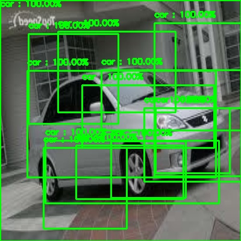
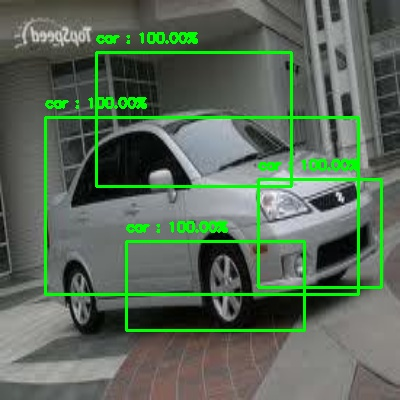

# Basic R-CNN
- Region-based Convolutional Neural Networks
- Implementation of Paper [Rich feature hierarchies for accurate object detection and semantic segmentation]( https://arxiv.org/abs/1311.2524)

## RCNN Working 
1. Create Raw Dataset With Images and its labels along with bounding boxes annotations of Objects in image.
2. Apply <b>Selective Search Algorithm</b> on images to segment the image and use <b>Region proposal algorithm</b> to create rectangular regions that may or may not contain object.
3.    Filter out only those regions which have high <b>IOU Overlap</b> with ground truth bounding boxes ( Because they will cover object in the image )
4. Create another dataset of these filtered regions with their original labels. Resize these region proposal to the size of neural network input size. Also create new class in this dataset which contains negative regions i.e image regions which do not contains object.
5.  Use Pretrained Neural network for transfer learning.<b> Fine tune</b> it with the region proposal dataset with <b>K+1 output </b>classes ( K = number of object classes present ) . Addition of 1 is due to classifying extra class of Negative proposals.
6. Neural Network is used for <b>feature generation</b> ( Here VGG16 trained on Imagenet is Used ). Classification head  have dense layers and <b> softmax</b> layer as output. <b>Binary svm</b> can also be used for classification after feature generation.
7. After Training the model , For inference , again find proposal for the image and predict those proposals with trained model. Filter out proposals which are predicted as negative class.
8. Use <b>Non-Max Suppression algorithm</b> to reduce the the bounding boxes using the probability scores of predictions and generate accurate boxes.

## Datasets
- <b>[Raw Images Dataset](https://drive.google.com/file/d/1hAE40pEb1VY3rauYpd7BY2RSaxsoHq5p/view?usp=sharing) </b></br>
	Created from </br>
	1] http://www.vision.caltech.edu/visipedia/CUB-200.html</br>
	2] http://ai.stanford.edu/~jkrause/cars/car_dataset.html </br>

- <b>[Extracted Region Proposals Dataset](https://drive.google.com/file/d/1Vi-bkG0SlGOvGP9bYFWeCGnlkgDe4FVr/view?usp=sharing)</b> </bt>
		&nbsp; &nbsp; &nbsp;Classes In Dataset</br>
			&nbsp; &nbsp; &nbsp;&nbsp; &nbsp; &nbsp;1) Birds </br> 
			&nbsp; &nbsp; &nbsp;&nbsp; &nbsp; &nbsp;2) Cars </br> 
			&nbsp; &nbsp; &nbsp;&nbsp; &nbsp; &nbsp;3) Negative Examples </br>


## Directory & Files 
&nbsp; &nbsp; &nbsp;<b>1. Region Proposal & Final_dataset_creation .ipynb</b></br>
&nbsp; &nbsp; &nbsp;&nbsp; &nbsp; &nbsp; Creates final proposal dataset on raw images by applying selective search </br>
&nbsp; &nbsp; &nbsp;&nbsp; &nbsp; &nbsp; Creates Negative examples by using IOU scores of proposal and ground Truth boxes.</br>

&nbsp; &nbsp; &nbsp;<b>2.Fine_tuning_model.ipynb</b></br>
&nbsp; &nbsp; &nbsp;&nbsp; &nbsp; &nbsp; Trains model on the final Dataset</br>
&nbsp; &nbsp; &nbsp; &nbsp; &nbsp; &nbsp; VGG16 trained on imagenet is used as backbone </br>

&nbsp; &nbsp; &nbsp;<b>3.inference.py</b></br>
&nbsp; &nbsp; &nbsp;&nbsp; &nbsp; &nbsp; Predicts the best matching proposal with object class</br>
&nbsp; &nbsp; &nbsp; &nbsp; &nbsp; &nbsp;Uses Non-max suppression to reduce unwanted boxes</br>

&nbsp; &nbsp; &nbsp;<b>4.NMS.py</b></br>
&nbsp; &nbsp; &nbsp;&nbsp; &nbsp; &nbsp; NMS algorithm implementation</br>

## Inference
```  
$ python3 inference.py -i <path_to_image> -m <path_to_model>
```
&nbsp;&nbsp;&nbsp;&nbsp; Results are stored in Output Folder

## Pretrained Model 
- VGG16 model fine tuned with generated dataset. 
-  Keras is used for Model training.
- Model Trained with 5 epochs.
- Download Link : <b>[Model](https://drive.google.com/file/d/1Ti262Q34XzQT5JN9ttJXrqUz9enFd_hE/view?usp=sharing)</b>

## Results 

*Before NMS* *After NMS*

*Before NMS* *After NMS*

## Improvements

- Hard Negative Mining can be applied to which helps to classify hard Negative examples.
- Neural Network gives probability almost 1 to correctly classified examples which creates problem in NMS algorithm to remove unnecessary boxes.
- Different Thresholds can for Overlapping in NMS can be used.
- Different number of proposal can be considered for quality region generation.

## References
- https://lilianweng.github.io/lil-log/2017/12/31/object-recognition-for-dummies-part-3.html#common-tricks
- https://www.pyimagesearch.com/2020/07/13/r-cnn-object-detection-with-keras-tensorflow-and-deep-learning/ 
- https://medium.com/@selfouly/r-cnn-3a9beddfd55a
